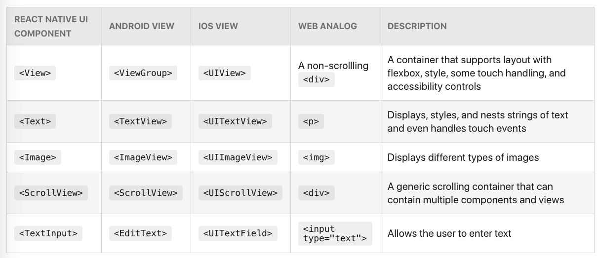

# Overview

This is a document to help me learn React Native, including setup, tooling etc. Started: 12/1/20

## React Native CLI

### Creating a new project

```
npx react-native init ProjectNameHere
```

### Running a React Native Application - Android
1. Start Metro

**Metro**: "takes in an entry file and various options, and returns a single JavaScript file that includes all your code and its dependencies."

(Can use Yarn as well)
```
npx react-native start
```
Keep Metro running in a separate terminal.

2. Start the application
```
npx react-native run-android
```

3. Modifying the app
- Edit anything in App.js
- Reload: Press R twice, or select Reload from Developer Menu (Command M)

# Getting started with React Native - Notes
This section follows the [official documentation](https://reactnative.dev/docs/getting-started) of React Native to learn the basics.

## Core Components and Native Components

### Views

View: Basic building block of UI e.g Image, Text - all make up the application overall.


### Native Components

- Instead of writing separate views in Java/Kotlin for Android and Swift in iOS, we use JavaScript using React components. Corresponding iOS / Android views are made during **runtime**.
- React Native components work as they would on a normal Android / iOS device, therefore they're called **Native Components**
- Core Components: Essential Native Components that are ready to use and provided by React Native.

**Links:**
- [Native Components by the community](https://reactnative.directory/)

### Core Components

Core Components: [Documentation link](https://reactnative.dev/docs/components-and-apis)

Below is an example of **Core Components** which are used frequently.



React Native components have the **same API structure as React components** - this is shown as an image below. 


### React Fundamentals - quick refresher

React Native runs on React, so basic knowledge of React is helpful when working with RN.

- Components
- JSX
- Props
- State: "Use props to configure a component when it renders. Use state to keep track of any component data that you expect to change over time."

[JavaScript Imports / Exports](https://medium.com/dailyjs/javascript-module-cheatsheet-7bd474f1d829)

### Handling Text Input

- **TextInput**: Core Component for entering text
- onChangeText: Prop that takes a function to call whenever text changes
- onSubmitEditing: Function to call when text is submitted

**Example of using Text Input:**
```js
import React, { useState } from 'react';
import { Text, TextInput, View } from 'react-native';

const PizzaTranslator = () => {
  const [text, setText] = useState('');
  return (
    <View style={{padding: 10}}>
      <TextInput
        style={{height: 40}}
        placeholder="Type here to translate!"
        onChangeText={text => setText(text)}
        defaultValue={text}
      />
      <Text style={{padding: 10, fontSize: 42}}>
        {text.split(' ').map((word) => word && '🍕').join(' ')}
      </Text>
    </View>
  );
}

export default PizzaTranslator;
```

### Handling Touches

- RN has componets to handle lots of gesture
- Button: Basic button component which renders relative to the OS you are on
- Touchables: Component to customise the gestures recognised by the button.
- Docs mention [Pressable](https://reactnative.dev/docs/pressable) as newer

### Using a ScrollView
13/1/21: Got up to [Using a ScrollView](https://reactnative.dev/docs/using-a-scrollview)

## React Native with Expo

To Do: Learn how Expo handles things for the developer compared to R.N development without Expo

## CodeJam Notes - 14/1/21

### Navigating between screens

### Styling
- We can use **StyleSheet** which comes with React Native to use out of the box styles.